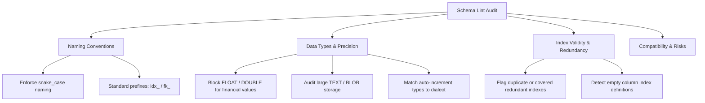

# Schema Lint

This guide details how to use DDLBuilder's built-in **Schema Lint** rule engine to perform automated static audits and eliminate naming issues, type defects, and redundant indexes at design time.

## Overview

Enforce team-wide database standards automatically, preventing naming mistakes, floating-point currency hazards, and orphaned indexes before DDL hits staging or production.

---

## Core Rule Dimensions

The Schema Lint engine audits designs against industry best practices across four key dimensions:

---

## Operations Walkthrough

1. Click the **Schema Lint** button in the table configuration header.
2. **Review Diagnostic Reports**:
   - Issues are categorized by severity: **Error**, **Warning**, and **Info**.
   - Each item includes the violation cause, affected column/index, and recommended remediation.
3. **Remediate Issues**:
   - Address all **Error** level items first (such as imprecise `FLOAT` financial columns or missing primary keys).
   - Adjust configurations in the field or index table; the diagnostic report refreshes in real time.
4. **Dismiss & Acknowledge**: For valid domain exceptions (such as legacy columns), mark items as acknowledged to preserve the audit trail.

---

## Verification Checklist

- [ ] The Schema Lint panel reports zero blocking Error-level issues.
- [ ] Remaining Warnings have been reviewed and accepted by data architects.
- [ ] Column names, index prefixes, and data types conform to team engineering guidelines.

## Tips and Best Practices

::: tip Dialect-Aware Linting
Rules adjust automatically to match active database dialects (e.g., Oracle `NUMBER` vs. MySQL `DECIMAL`). Changing dialects re-evaluates rules against the new engine's constraints.
:::

- **Minimum Schema**: A table must have at least one column configured to run a valid Lint scan.
- **Pairing with Master Review**: Static linting checks structural syntax; combine it with Master Review for comprehensive semantic and architecture feedback.
