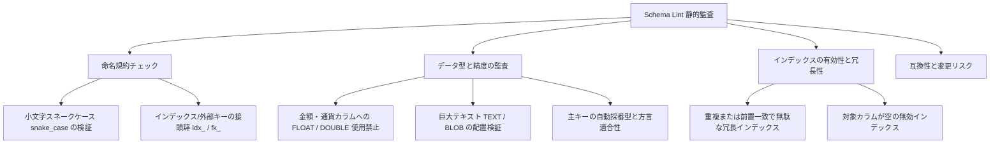

# Schema Lint

このガイドでは、DDLBuilder に標準搭載されている **Schema Lint** 静的解析ルールエンジンを利用して、命名規約違反、不適切なデータ型、冗長インデックスなどの問題を設計段階で自動検出・解消する手順を解説します。

## 概要

開発チーム内のデータベース設計規約を自動化し、人的なコードレビューで見落としがちな命名ミスや、金額カラムへの浮動小数点型の誤用、不要なインデックスを未然に防止します。

---

## 監査ルールの主要観点

Schema Lint エンジンは、業界標準のベストプラクティスに基づき 4 つの観点から包括的に検証します。

---

## 主な操作手順

1. テーブル設定エリア内の **「Schema チェック」**（または **「Lint」**）ボタンをクリックします。
2. **診断レポートの確認**:
   - 検出された問題が **エラー（Error）**、**警告（Warning）**、**情報（Info）** の重要度別に一覧表示されます。
   - 各項目には、規約違反の理由と推奨される修正方針が明記されます。
3. **問題の修正と即時再検証**:
   - **エラー** 項目（例: 金額カラムに `FLOAT` を指定している、主キーが存在しない等）を優先して修正します。
   - フィールドやインデックス設定を変更すると、Lint レポートがリアルタイムに更新されます。
4. **意図的な例外の確認**: レガシー互換など業務上意図的な設計については、確認済みとしてマークできます。

---

## 完了のチェックリスト

- [ ] Schema Lint パネルに致命的なエラー（Error）項目が存在しない。
- [ ] 警告（Warning）項目がレビューされ、意図通りの設計であることが確認されている。
- [ ] カラム名、インデックス接頭辞、型定義がチームの標準規約に準拠している。

## 注意事項

::: tip データベース方言に応じたルール適合
データベース方言ごとにデータ型の扱いが異なります（例: Oracle の `NUMBER` と MySQL の `DECIMAL`）。Lint エンジンは選択中の方言に合わせて自動的に判定基準を調整します。
:::

- **実行の前提条件**: テーブルに少なくとも 1 つのカラムが定義されている必要があります。
- **マスターレビューとの併用**: Schema Lint は構文的・静的な規約を検査します。業務要件に踏み込んだ設計評価には「マスターレビュー」の併用をお勧めします。
