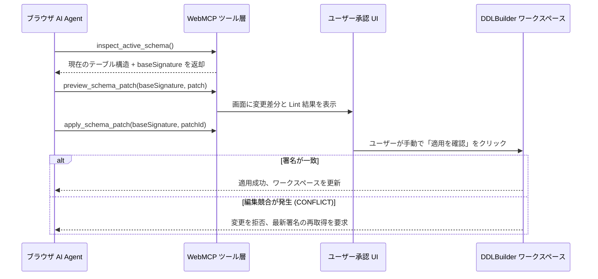

# WebMCP Agent ワークフロー

このガイドでは、**WebMCP（Web Model Context Protocol）** を活用して、ブラウザ内の AI Agent が DDLBuilder と直接構造化された通信を行い、テーブルの自動検査、リバースインポート、安全なパッチ適用を行う手順を解説します。

## 概要

WebMCP 対応ブラウザ（例: 実験的フラグを有効にした Chrome）上で動作する AI アシスタント（Gemini Nano、Claude 等のブラウザ Agent）が、DOM 解析やスクリーンショットに頼ることなく、現在のテーブル構造を正確に読み取り、規約チェックやユーザー承認付きの変更パッチを提案できます。

---

## 提供ツールと機能一覧

DDLBuilder は主要なドメイン操作を型付けされた WebMCP ツールとして公開しています。

| ツール名 | 機能と動作説明 |
|---|---|
| `inspect_active_schema` | 現在のテーブルの概要、カラム一覧、インデックス、外部キー、ストレージ設定をページング取得 |
| `lint_active_schema` | 現在のテーブルに対して決定論的な Schema Lint 規約チェックを実行し、問題一覧を返却 |
| `read_generated_output` | 生成された DDL、DCL、ORM モデル、ALTER 移行文、ロールバック DDL を取得 |
| `preview_schema_patch` | Agent が提案したカラム・インデックスの変更パッチを受け取り、差分プレビューを生成（即時反映はしない） |
| `import_sql_preview` | 指定した方言で SQL を解析し、インポートプレビューを生成 |
| `apply_schema_patch` | ユーザーが画面上で確認・承認した後に、パッチをアトミックに反映（署名による競合防止付き） |
| `get_auth_status` | ログイン状態と利用可能機能を確認（プライバシー保護のため、メールアドレスや残高は非公開） |
| `start_sign_in` | ログインダイアログを表示（パスワードや認証はユーザーが安全な画面内で完結） |

---

## 安全な変更パッチの適用フロー

AI による予期しない改変や並行編集の競合を防ぐため、WebMCP は**バージョン署名（`baseSignature`）**を用いた楽観的排他制御を採用しています。

---

## 完了のチェックリスト

- [ ] ブラウザ環境で `document.modelContext` が認識され、DDLBuilder のツールが登録されている。
- [ ] Agent がツール経由で現在のテーブル定義や Lint 結果を正常に取得できる。
- [ ] 変更パッチの適用時に、画面上でユーザーの手動確認ダイアログが必ず表示される。
- [ ] 読み取り専用共有ページでは、Agent による閲覧は可能だが書き込みが拒否される。

## 注意事項と制約事項

::: warning ユーザーによる手動確認の必須性
Agent が確認ダイアログを迂回してテーブルを直接変更することはできません。`apply_schema_patch` で送信された変更は、すべてユーザーの目視確認と承認を経て反映されます。
:::

- **ブラウザの対応状況**: WebMCP は策定中の仕様です。有効化フラグや最新仕様については [Chrome WebMCP 公式ドキュメント](https://developer.chrome.com/docs/ai/webmcp) をご確認ください。
- **セッションのライフサイクル**: WebMCP はアクティブなブラウザタブと連動します。タブを閉じるかリロードするとツールのコンテキストはリセットされます。
- **ヘッドレス / CI 環境**: CI/CD パイプラインやサーバーサイド Agent など、ブラウザタブを伴わない環境では、WebMCP ではなくバックエンドの標準 MCP をご利用ください。
