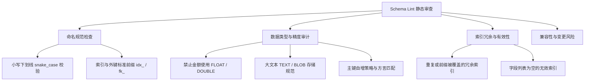

# Schema 规范检查

本指南介绍如何使用筑表师内置的 **Schema Lint** 规则引擎进行自动化静态代码审查，在设计阶段前置消除命名隐患、类型缺陷与冗余索引。

## 适用场景

适用于团队统一数据库设计规范，避免在繁琐的人工代码审查中遗漏低级命名错误、高危浮点金额类型或无用索引。

---

## 核心审查规则维度

Schema Lint 引擎内置了多项行业最佳实践规则，涵盖以下核心维度：

---

## 核心操作指引

1. 在表配置区域点击 **Schema 检查** 或 **Lint** 按钮。
2. **审查问题报告**：
   - 系统展示诊断结果列表，并按 **错误（Error）**、**警告（Warning）**、**提示（Info）** 进行分级。
   - 每条规则附带清晰的违规原因和优化建议。
3. **修复与迭代**：
   - 优先修复 **错误级别** 的严重隐患（如金额字段使用了不精确的 `FLOAT`，或缺少主键）。
   - 回到字段或索引配置面板修改后，Lint 报告将自动实时刷新。
4. **忽略与留痕**：对于特定业务合理保留的设计（如特殊命名的遗留字段），可标记为已知晓。

---

## 校验与完成标志

- [ ] Schema Lint 面板中不存在阻断性的错误级别问题。
- [ ] 警告与提示项均经过架构师确认符合预期。
- [ ] 字段命名、索引前缀与类型约束完全符合团队工程规范。

## 常见注意事项

::: tip 规范规则与数据库方言联动
不同数据库方言在类型判定上有细微差异（例如 Oracle 的 `NUMBER` 与 MySQL 的 `DECIMAL`）。Lint 引擎会根据当前选定的数据库类型自适应切换审查基准。
:::

- **前置条件**：当前表需至少配置一个字段方可触发有效的 Lint 扫描。
- **结合人工评审**：自动化 Lint 聚焦于通用静态规则，复杂的业务逻辑约束建议结合“大师评审”进一步审查。
