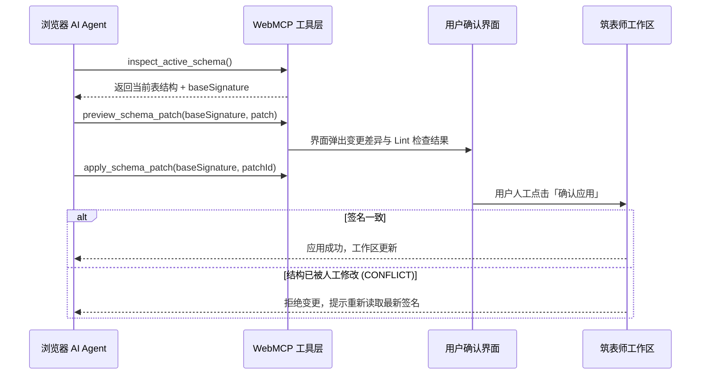

# WebMCP Agent 协作

本指南介绍如何利用 **WebMCP（Web Model Context Protocol）** 协议，让浏览器端 AI Agent 直接与筑表师进行结构化交互，实现自动化表结构审查、逆向导入与安全变更。

## 适用场景

适用于在支持 WebMCP 的浏览器（如启用了 Experimental 特性的 Chrome）中使用 AI 助手（如 Gemini Nano、Claude 等浏览器 Agent），让 Agent 理解你正在设计的数据库表结构，并执行自动化检查或提出经你确认的修改建议。

---

## 协议能力与工具清单

筑表师将核心领域能力封装为结构化工具，Agent 无需解析 DOM 或依赖截图即可精准调用：

| 工具名称 | 工具作用与说明 |
|---|---|
| `inspect_active_schema` | 分页读取当前活动表的概要信息、字段列表、索引、关系及表级存储参数 |
| `lint_active_schema` | 对当前表结构执行确定性的 Schema Lint 规则审查，返回问题清单 |
| `read_generated_output` | 分段读取当前表生成的 DDL、DCL、ORM 模型、ALTER 语句或回滚脚本 |
| `preview_schema_patch` | 接收 Agent 提议的字段与索引修改，生成差异预览而不直接写入工作区 |
| `import_sql_preview` | 传入 SQL 脚本并按指定方言生成逆向解析预览 |
| `apply_schema_patch` | 在用户于界面中点击确认后，原子应用补丁（带版本签名防冲突校验） |
| `get_auth_status` | 检查当前登录状态及可用能力组（出于隐私保护，不暴露邮箱与点数） |
| `start_sign_in` | 唤起前端登录弹窗，密码与人机验证完全由用户在安全界面中完成 |

---

## 安全变更工作流

为防止 Agent 产生非预期的幻觉修改或多端并发覆盖，WebMCP 采用基于**版本签名（`baseSignature`）**的乐观并发控制：

---

## 校验与完成标志

- [ ] 浏览器控制台中能识别 `document.modelContext` 及 DDLBuilder 注册的工具。
- [ ] Agent 可通过工具顺利读取当前活动表的字段与索引。
- [ ] 变更补丁需要用户在页面弹窗中人工点击确认方可生效。
- [ ] 只读分享页面能被 Agent 读取，但会阻止任何写入尝试。

## 常见注意事项与约束

::: warning 安全与人工确认
Agent 永远无法绕过前端确认窗口直接篡改你的表结构。所有通过 `apply_schema_patch` 提交的变更均需经过人工二次复核。
:::

- **浏览器支持度**：WebMCP 目前处于 Web 标准演进阶段，具体支持情况与本地开关请参考 [Chrome WebMCP 官方文档](https://developer.chrome.com/docs/ai/webmcp)。
- **页面生命周期**：WebMCP 依赖当前活跃的前端标签页，关闭或刷新页面后工具上下文会被重置。
- **无头/服务端场景**：如果是 CLI、自动化 CI 管道或云端无头 Agent，请使用后端的标准 MCP 接口，而非依赖浏览器 WebMCP。
