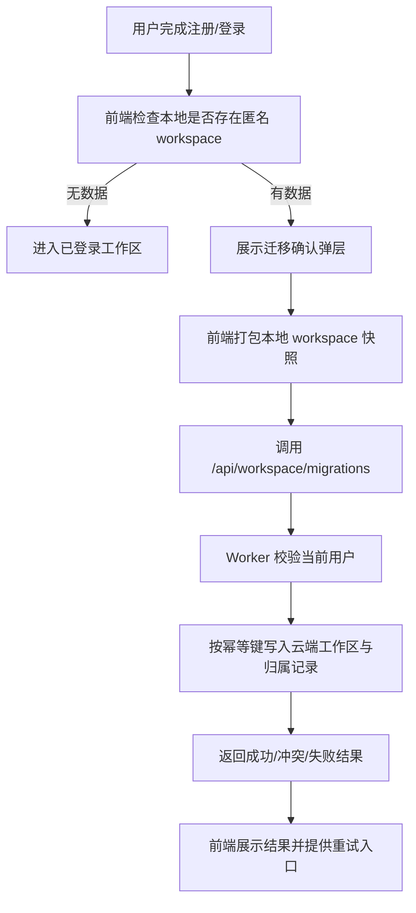

# KLIP-29 匿名工作区迁移到注册用户

## 现状结论

- 当前匿名工作区数据主要分布在 IndexedDB：
  - `saved_tables`
  - `workspace_global_draft`
  - `workspace_saved_drafts`
  - `workspace_session`
  见 `src/utils/savedTablesDb.ts` 与 `src/utils/workspaceStateDb.ts`
- 启动期恢复逻辑在 `src/hooks/usePersistedState.ts` 与 `src/hooks/workspacePersistence/bootstrap.ts`
- 当前分享视图和主工作区恢复都依赖本地状态，不存在云端用户工作区实体

## 背景

如果用户注册后无法带走现有匿名工作区，注册动作会直接破坏当前产品的连续性。这个问题的核心不是“上传本地文件”，而是：

- 本地哪些数据应认领
- 同名内容如何处理
- 重复迁移如何避免双写
- 迁移失败如何回滚和重试

## 目标

- 让匿名用户注册或首次登录后，能把现有本地工作区认领到用户名下
- 保证迁移过程可见、可重试、可恢复
- 定义冲突策略与幂等策略

## 非目标

- 不做多端实时同步
- 不做增量双向同步
- 不迁移与用户价值弱相关的数据，只迁移明确有业务价值的工作区内容

## 状态边界

### 必迁移

- `workspace_global_draft`
- 当前 `workspace_session` 指向的激活状态
- `saved_tables`
- `workspace_saved_drafts`

### 默认不迁移

- `review_history`
- `table_versions`
- `field_templates`
- `table_folders`

理由：

- 这些数据对“注册后继续工作”不是阻塞项
- 先迁移核心工作区内容，能显著降低迁移复杂度
- 后续若证明有真实价值，可单独追加迁移 issue

## 设计概览

### 迁移触发点

- 首次注册成功后
- 已有账号首次登录且本地存在匿名 workspace 时

### 迁移流程



### 上传粒度

迁移 payload 使用结构化快照：

```typescript
type WorkspaceMigrationPayload = {
  idempotencyKey: string;
  globalDraft: PersistedState | null;
  activeSession: {
    source: WorkspaceSource | null;
    state: PersistedState | null;
  };
  savedTables: Array<{
    normalizedName: string;
    name: string;
    state: PersistedState;
    updatedAt: number;
  }>;
  savedDrafts: Array<{
    normalizedName: string;
    tableName: string;
    state: PersistedState;
    updatedAt: number;
    baseSignature: string;
  }>;
};
```

### 冲突策略

#### 同名 saved table

- 默认不静默覆盖
- 若云端不存在：直接创建
- 若云端存在且内容相同：视为已迁移
- 若云端存在且内容不同：返回冲突项，要求用户逐项选择：
  - 保留云端
  - 以本地副本另存为

#### 全局草稿

- 云端无草稿：直接写入
- 云端已有草稿：保留更新时间较新的版本，并提示用户另一份已另存为备份草稿

### 幂等策略

- 前端每次发起迁移都生成 `idempotencyKey`
- 服务端在 `workspace_links` / migration 记录表中记住执行结果
- 同一个 key 重试必须返回同一个结果摘要

### 失败恢复

- 服务端迁移为“每张表独立 upsert + 总结返回”，不要求单事务打包全部对象
- 失败结果要带：
  - 成功项
  - 冲突项
  - 失败项
- 前端只对失败项提供重试，不重复提交已成功项

## 阶段进展

### Phase 1

- 读取本地快照
- 设计迁移 payload
- 实现基础云端 upsert

### Phase 2

- 加入冲突识别
- 加入幂等记录
- 加入 UI 重试与结果摘要

## 测试矩阵

- 本地无数据时不触发迁移
- 本地只有全局草稿时可迁移
- 本地存在多个 saved table 时可迁移
- 同名同内容时不重复创建
- 同名不同内容时返回冲突
- 中途失败后可针对失败项重试
- 同一个 `idempotencyKey` 重放不会双写

## 验收标准

- [ ] 匿名用户注册后可迁移本地现有工作区
- [ ] 冲突行为明确，不静默覆盖
- [ ] 失败后可重试
- [ ] 重复迁移不会双写
- [ ] 迁移 UI 能明确展示成功/冲突/失败状态

## 关键参考位置

- `src/utils/savedTablesDb.ts`
- `src/utils/workspaceStateDb.ts`
- `src/hooks/usePersistedState.ts`
- `src/hooks/workspacePersistence/bootstrap.ts`
- `src/types/workspace.ts`
