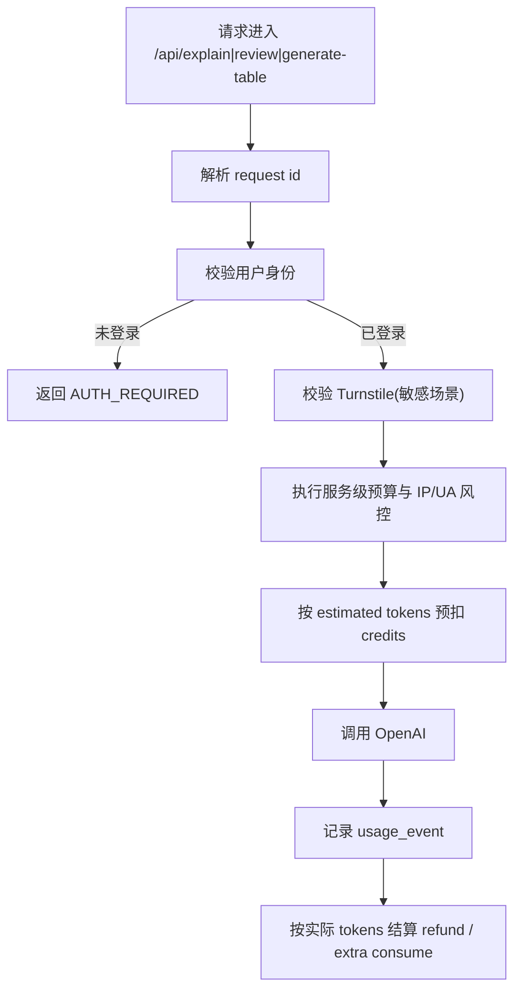

# KLIP-31 AI 路由接入用户额度扣减与反滥用控制

## 背景

当前 AI 路由已经具备统一治理骨架，但治理对象仍是匿名调用：

- 路由：`server-api/routes/explain.ts`、`review.ts`、`generateTable.ts`
- 治理：`server-api/openaiControl.ts`
- 能力：限流、预算、重试、audit

本期目标不是推翻现有治理，而是把治理对象从“匿名请求”升级为“用户额度 + 风控兜底”的组合策略。

## 目标

- `explain`、`review`、`generate-table` 全部接入用户鉴权
- 登录用户按个人额度调用 AI
- 匿名用户仍能看到 AI 功能，但不能实际调用
- 保留 `RATE_LIMIT_KV` 作为匿名和风控兜底
- 增加请求幂等与失败补偿

## 非目标

- 不改 AI prompt 逻辑
- 不改 OpenAI 上游接入协议
- 不做复杂的风控评分系统

## 设计方案

### 总体链路

### 三层治理边界

#### 第一层：服务级预算

- 继续沿用 `server-api/openaiControl.ts` 的 daily budget
- 作用：保护整体服务成本

#### 第二层：用户级额度

- 登录用户请求必须先通过余额校验
- 余额不足直接返回 `CREDIT_EXHAUSTED`

#### 第三层：风控限流

- 继续保留 `RATE_LIMIT_KV`
- 仍基于 IP + UA 指纹作为兜底
- 匿名用户也使用该层

### 鉴权与错误码

建议新增统一错误码：

- `AUTH_REQUIRED`
- `CREDIT_EXHAUSTED`
- `TURNSTILE_REQUIRED`
- `TURNSTILE_FAILED`
- `IDEMPOTENCY_CONFLICT`

### 幂等策略

- 每次 AI 请求都生成 `request_id`
- 额度预扣与 usage event 共用该幂等主键
- 若客户端重试相同请求，应携带同一个 `Idempotency-Key`

### 路由改造方式

不复制三套路由逻辑，改为抽公共中间件：

- `withUserGuard(routeKey)`
- `withCreditReservation(routeKey)`
- `finalizeUsage(routeKey, usage)`

这样可以复用现有 `openaiControl.ts` 的审计与预算逻辑，避免把鉴权/额度代码散落到三个 route 文件里。

## 对外行为变化

### 匿名用户

- 前端可见 AI 按钮
- 调用时直接返回 `AUTH_REQUIRED`
- 文案由前端映射成“注册后解锁”

### 已登录但余额不足

- 服务端返回 `CREDIT_EXHAUSTED`
- 前端展示“额度不足”，与服务异常区分

### 已登录且可用

- 正常调用
- 完成后返回最新余额摘要或允许前端自行刷新

## 测试矩阵

- 匿名用户调用任一 AI 路由被拒绝
- 已登录且有余额时可调用
- 已登录但余额不足时被拒绝
- 同一幂等键重试不重复扣减
- OpenAI 上游失败会自动 refund
- 服务级预算用尽时先于用户额度失败
- `RATE_LIMIT_KV` 仍可拦截异常高频请求

## 验收标准

- [ ] 三个 AI 路由都接入用户鉴权
- [ ] 登录用户调用 AI 时会扣减个人额度
- [ ] 匿名用户可见但不可调用 AI
- [ ] 重试不会重复扣减
- [ ] 服务级预算、用户级额度、风控限流边界清晰

## 关键参考位置

- `server-api/openaiControl.ts`
- `server-api/routes/explain.ts`
- `server-api/routes/review.ts`
- `server-api/routes/generateTable.ts`
- `api/index.ts`
