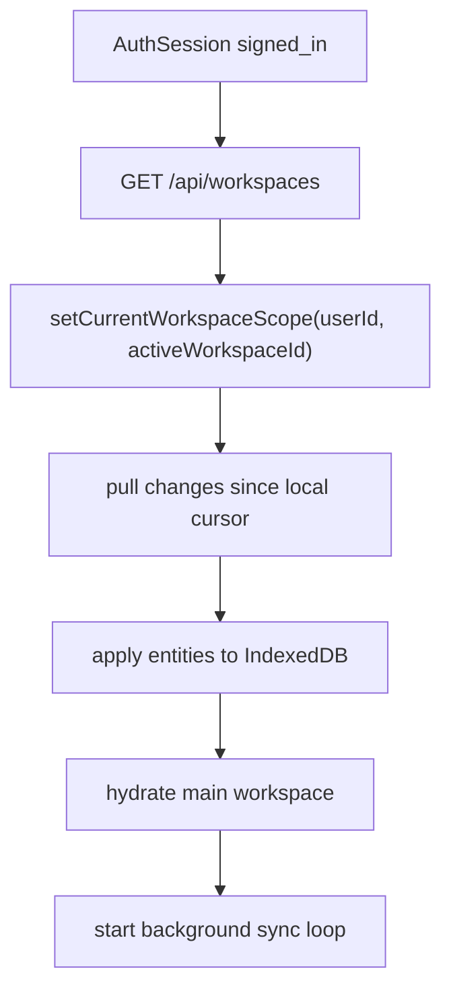

# klip-37-workspace-incremental-sync

## 现状结论（代码校准）

- 实体级 HTTP pull/push、workspace version、mutation 去重、冲突记录与本地 outbox 已完成。
- 该路径目前作为 Y.Doc 尚未激活时的兼容 fallback；登录态长期 runtime 权威已由 KLIP-38/39 的 Yjs + Durable Object 路径接管。
- D1 `workspace_entities` 继续承接 checkpoint projection 与恢复兼容，不再承担每次字段输入。

## 背景

- 用户期望登录态下的本地编辑能低感知同步到云端，换设备或清缓存后自动恢复。
- 当前手动上传/下载要求用户理解“本地”和“云端”两份状态，体验成本偏高。
- 全量覆盖路径会放大误操作影响，后续自动同步需要更小的写入粒度。
- 草稿箱和 saved table 的浏览行为会刷新本地更新时间，自动同步需要先区分“内容变更”和“视图切换”。
- 后续产品可能从单工作区升级为多工作区，所有同步实体需要从现在开始带上 `workspaceId`。
- 报告 `schema_sync.agent.final.md` 推荐的 Yjs/TinyBase + Durable Objects 路径适合实时协作阶段；当前核心需求是单用户多设备的持续同步。

## 目标

1. 将已登录用户的工作区同步从手动全量快照升级为实体级增量同步。
2. 登录后自动拉取默认工作区，首屏静默恢复云端内容。
3. 本地编辑先写 IndexedDB，再由后台同步队列推送到云端。
4. 草稿、saved table、saved draft、folder 都成为可同步实体。
5. 浏览行为只更新本地 view state，内容实体保持原 `updatedAt` 与 `contentHash`。
6. 登出后清空当前用户在本机的工作区可见状态，界面进入空白状态。
7. 数据模型预留多工作区：一个用户可拥有多个 workspace，同一时间激活一个 workspace。
8. 保留 KLIP-33 的手动上传/下载入口作为恢复工具与调试工具。

## 非目标

- 多人实时协作、presence、光标、字段级协同编辑进入后续 KLIP。
- Yjs、TinyBase、Durable Objects 进入实时协作阶段评估。
- `review_history`、`table_versions`、`field_templates` 默认保持本地存储，本轮只同步工作区核心内容。
- 跨用户共享、团队权限、workspace member 模型进入后续 KLIP。
- SQL 迁移脚本生成、schema diff UI、版本历史进入后续 KLIP。

## 术语表

- `workspace`：用户可切换的工作区容器。当前版本先创建一个默认 workspace。
- `entity`：workspace 内的同步单位，包括 `draft`、`saved_table`、`saved_draft`、`folder`。
- `workspace scope`：本地 IndexedDB 读写边界，目标形态为 `user:{userId}:workspace:{workspaceId}`。
- `view state`：当前打开的 tab、激活 source、抽屉展开状态、当前编辑面板等 UI 状态。view state 默认本地化。
- `contentHash`：实体 payload 的稳定 hash，用于判断内容是否真实变化。
- `cursor`：客户端已应用到本地的云端最大变更版本。
- `outbox`：本地待推送变更队列，网络恢复后继续提交。

## 设计概览

1. **云端改为 workspace + entity 模型**：每个用户至少有一个默认 workspace，每个 workspace 内存储多个 entity。
2. **同步协议改为 pull/push changes**：客户端按 `cursor` 拉取云端增量，按 entity 提交本地 outbox。
3. **服务端维护单调版本**：每个 workspace 有递增 `version`，所有 entity upsert/delete 都产生新版本。
4. **客户端内容变更触发 outbox**：保存草稿、保存表、移动 folder、删除实体会入队；打开实体、切换 tab、浏览公共项目只更新 view state。
5. **冲突以 entity 为边界**：同一实体被两端同时修改时，服务端返回 conflict，客户端保留本地副本并提示用户处理。
6. **登出路径先同步后清理**：登出前触发一次 pending outbox flush，完成后清空当前 user workspace 的本地缓存与内存状态。
7. **手动同步保留为恢复工具**：设置页继续提供“强制上传 / 强制下载”，默认路径走自动增量。

## 数据存储

### 1. 云端 D1

新增 workspace 表与 entity 表。`workspace_snapshots` 保留给 KLIP-29/KLIP-33 的兼容入口和一次性迁移兜底。

```sql
CREATE TABLE workspaces (
  id TEXT PRIMARY KEY,
  user_id TEXT NOT NULL,
  name TEXT NOT NULL,
  is_default INTEGER NOT NULL DEFAULT 0,
  active_at INTEGER,
  created_at INTEGER NOT NULL,
  updated_at INTEGER NOT NULL,
  FOREIGN KEY (user_id) REFERENCES user(id) ON DELETE CASCADE
);

CREATE UNIQUE INDEX idx_workspaces_user_default
  ON workspaces(user_id, is_default)
  WHERE is_default = 1;

CREATE TABLE workspace_clocks (
  workspace_id TEXT PRIMARY KEY,
  next_version INTEGER NOT NULL,
  FOREIGN KEY (workspace_id) REFERENCES workspaces(id) ON DELETE CASCADE
);

CREATE TABLE workspace_entities (
  id TEXT PRIMARY KEY,
  workspace_id TEXT NOT NULL,
  user_id TEXT NOT NULL,
  entity_type TEXT NOT NULL CHECK (entity_type IN ('draft', 'saved_table', 'saved_draft', 'folder')),
  entity_id TEXT NOT NULL,
  payload_json TEXT,
  content_hash TEXT,
  version INTEGER NOT NULL,
  deleted_at INTEGER,
  created_at INTEGER NOT NULL,
  updated_at INTEGER NOT NULL,
  FOREIGN KEY (workspace_id) REFERENCES workspaces(id) ON DELETE CASCADE,
  FOREIGN KEY (user_id) REFERENCES user(id) ON DELETE CASCADE
);

CREATE UNIQUE INDEX idx_workspace_entities_key
  ON workspace_entities(workspace_id, entity_type, entity_id);

CREATE INDEX idx_workspace_entities_changes
  ON workspace_entities(workspace_id, version);
```

### 2. 云端实体类型

```typescript
type WorkspaceEntityType = 'draft' | 'saved_table' | 'saved_draft' | 'folder';

type WorkspaceEntityEnvelope<TPayload> = {
  workspaceId: string;
  entityType: WorkspaceEntityType;
  entityId: string;
  version: number;
  contentHash: string | null;
  payload: TPayload | null;
  deletedAt?: number;
  updatedAt: number;
};
```

实体映射规则：

| entityType      | entityId 来源                         | payload 来源                                      |
|-----------------|---------------------------------------|---------------------------------------------------|
| `draft`         | `draftId`                             | `WorkspaceDraftRecord`                            |
| `saved_table`   | 稳定 UUID，迁移期可先用 `normalizedName` | `SavedTableRecord`                                |
| `saved_draft`   | saved table 的 `entityId`             | `SavedTableDraftRecord`                           |
| `folder`        | `folder.id`                           | `TableFolder`                                     |

### 3. 本地 IndexedDB

现有 stores 继续承载业务数据，新增同步元数据 store：

```typescript
type LocalWorkspaceSyncMeta = {
  id: string; // workspaceId
  userId: string;
  cursor: number;
  lastPulledAt?: number;
  lastPushedAt?: number;
};

type LocalWorkspaceOutboxItem = {
  id: string; // clientMutationId
  workspaceId: string;
  entityType: WorkspaceEntityType;
  entityId: string;
  op: 'upsert' | 'delete';
  baseVersion: number | null;
  contentHash: string | null;
  payload: unknown | null;
  createdAt: number;
  attemptCount: number;
};
```

本地 scope 目标形态：

```typescript
type WorkspaceScope =
  | { kind: 'anonymous' }
  | {
      kind: 'user';
      userId: string;
      workspaceId: string;
    };
```

## 协议设计

### 1. 获取 workspace 列表

`GET /api/workspaces`

用途：登录后获取当前用户 workspace 列表；没有 workspace 时服务端创建默认 workspace。

```typescript
type WorkspaceListResponse = {
  workspaces: Array<{
    id: string;
    name: string;
    isDefault: boolean;
    activeAt?: number;
    updatedAt: number;
  }>;
  activeWorkspaceId: string;
};
```

### 2. 拉取增量

`GET /api/workspaces/:workspaceId/changes?since={cursor}`

```typescript
type WorkspaceChangesResponse = {
  workspaceId: string;
  cursor: number;
  entities: Array<WorkspaceEntityEnvelope<unknown>>;
};
```

示例：

```json
{
  "workspaceId": "ws_default_01",
  "cursor": 42,
  "entities": [
    {
      "workspaceId": "ws_default_01",
      "entityType": "draft",
      "entityId": "draft_abc",
      "version": 40,
      "contentHash": "sha256:aaa",
      "payload": {
        "state": { "tableName": "users", "rows": [] },
        "createdAt": 1777564800000,
        "updatedAt": 1777564860000
      },
      "updatedAt": 1777564860000
    },
    {
      "workspaceId": "ws_default_01",
      "entityType": "folder",
      "entityId": "folder_old",
      "version": 42,
      "contentHash": null,
      "payload": null,
      "deletedAt": 1777564900000,
      "updatedAt": 1777564900000
    }
  ]
}
```

### 3. 推送本地变更

`POST /api/workspaces/:workspaceId/changes`

```typescript
type WorkspaceChangesPushRequest = {
  changes: Array<{
    clientMutationId: string;
    entityType: WorkspaceEntityType;
    entityId: string;
    op: 'upsert' | 'delete';
    baseVersion: number | null;
    contentHash: string | null;
    payload: unknown | null;
  }>;
};

type WorkspaceChangesPushResponse = {
  cursor: number;
  accepted: Array<{
    clientMutationId: string;
    entityType: WorkspaceEntityType;
    entityId: string;
    version: number;
  }>;
  conflicts: Array<{
    clientMutationId: string;
    entityType: WorkspaceEntityType;
    entityId: string;
    serverVersion: number;
    serverContentHash: string | null;
    serverPayload: unknown | null;
  }>;
};
```

服务端处理规则：

| 场景                                      | 结果                                      |
|-------------------------------------------|-------------------------------------------|
| `clientMutationId` 已处理                 | 返回已接受结果                            |
| 云端实体缺失，客户端 `upsert`             | 创建实体并分配新 version                  |
| 云端实体缺失，客户端 `delete`             | 写入 tombstone 并分配新 version           |
| 云端 `contentHash` 与客户端一致           | 视为已同步，出队                          |
| `baseVersion` 等于云端当前 version        | 接受变更并分配新 version                  |
| `baseVersion` 落后且 hash 不一致          | 返回 conflict                             |

## 服务端设计

### 1. Workspace 初始化

登录态调用 `GET /api/workspaces` 时，服务端保证用户拥有一个默认 workspace：

1. 查询 `workspaces WHERE user_id = ? AND is_default = 1`。
2. 缺失时创建 `workspaces` 与 `workspace_clocks`。
3. 返回 workspace 列表与 `activeWorkspaceId`。

### 2. Version 分配

每个 accepted change 使用 `workspace_clocks.next_version` 分配单调版本：

```sql
UPDATE workspace_clocks
SET next_version = next_version + 1
WHERE workspace_id = ?
RETURNING next_version;
```

返回值作为 entity 的新 `version`。D1/SQLite 的单写入模型适合该计数器。

### 3. Snapshot API 兼容

KLIP-33 的 `/api/workspace/snapshot` 暂时保留：

- 手动下载：从默认 workspace 的 `workspace_entities` 聚合为旧 `WorkspaceSnapshotResponse`。
- 手动上传：将旧 `WorkspaceSnapshotPushRequest` 转换为 entity changes 写入默认 workspace。
- 匿名迁移：KLIP-29 迁移完成后写入默认 workspace，同时保留 `workspace_links` 幂等记录。

### 4. 权限边界

所有 workspace API 都通过 `authenticateRequest()` 获取 `userId`，并在 SQL 条件中同时校验 `workspace_id` 与 `user_id`。跨用户 workspace 访问返回 `404`。

## 前端设计

### 1. 登录启动流程



启动约定：

- 登录态主工作区 hydration 等待默认 workspace 首次 pull 完成。
- pull 失败时使用本地 user scope 缓存进入工作区，并显示同步状态。
- 新设备本地 cursor 为 `0`，首次 pull 会下载全部 entity。

### 2. 内容变更与 view state 分离

`usePersistedState` 需要拆分两个动作：

```typescript
type WorkspaceActivationInput = {
  source: WorkspaceSource;
  state: PersistedState;
};

type WorkspaceEntityPersistInput = {
  source: WorkspaceSource;
  state: PersistedState;
  contentHash: string;
};
```

建议命名：

- `activateWorkspaceSource(input)`：只更新内存 active source、tab 状态和本地 session。
- `persistWorkspaceEntity(input)`：内容 hash 变化时写 IndexedDB、更新时间、outbox。

关键行为：

| 操作                                  | 写业务实体 | 写 view state | 入 outbox |
|---------------------------------------|------------|---------------|-----------|
| 点击已有草稿                          | 否         | 是            | 否        |
| 点击 saved table                      | 否         | 是            | 否        |
| 激活已打开 tab                        | 否         | 是            | 否        |
| 修改字段、索引、表注释                | 是         | 是            | 是        |
| 新建草稿                              | 是         | 是            | 是        |
| 删除草稿 / saved table / folder       | 是         | 是            | 是        |
| 打开 share/public 项目                | 否         | 本地缓存       | 否        |

### 3. 草稿箱语义

草稿是可同步业务实体。草稿的 `updatedAt` 表示草稿内容最后变化时间，点击草稿保持该时间。

saved table 的未保存修改继续用 `saved_draft` 表达：

- 载入 saved table 且内容保持原始签名：删除对应 `saved_draft`。
- 编辑 saved table 且内容 hash 变化：写入 `saved_draft`。
- 点击其他 saved table：保存当前实体真实内容后切换 view state。

### 4. Outbox 同步循环

前端新增 `workspaceIncrementalSyncService.ts`：

```typescript
type WorkspaceSyncStatus =
  | 'idle'
  | 'pulling'
  | 'pushing'
  | 'synced'
  | 'offline'
  | 'conflict'
  | 'error';
```

触发时机：

- 登录后首次 pull。
- 本地 entity 入 outbox 后 debounce 1 秒 push。
- `window.online` 后立即同步。
- 页面隐藏前执行一次 best-effort sync。
- 设置页点击“立即同步”触发 pull + push + pull。

同步顺序：

1. Pull remote changes since local cursor。
2. Apply remote accepted entities to local IndexedDB。
3. Push local outbox。
4. Remove accepted outbox items。
5. Conflicts 写入本地 conflict store。
6. Pull again to更新 cursor。

### 5. 登出行为

登出流程：

1. 暂停新的本地同步任务。
2. 对当前 workspace 执行一次 push。
3. 成功后清理当前 user workspace scope 的业务 stores、outbox、sync meta、tabs。
4. 设置当前运行态为空白 anonymous workspace。
5. 调用 auth client `signOut()` 并进入 signed out UI。

同步失败时，UI 给出“继续退出并丢弃本机缓存”和“返回继续同步”两个明确动作。默认动作是返回继续同步。

### 6. 多工作区预留

第一版只暴露默认 workspace。内部接口保留 workspace 列表和 active workspace：

- `WorkspaceScope` 增加 `workspaceId`。
- `setCurrentWorkspaceScope()` 接收 active workspace。
- `listSavedTables()`、`listDrafts()`、`listFolders()` 全部按 workspace scope 读取。
- 后续添加 workspace switcher 时，只需要切换 `activeWorkspaceId` 并重新 pull/hydrate。

## 迁移计划

### Phase 0：本地语义修正

目标：先消除浏览行为导致的伪更新。

- 拆分 `setWorkspaceSnapshot()` 的“激活 source”和“持久化实体”职责。
- 为 draft、saved draft、saved table、folder 计算稳定 `contentHash`。
- `saveState()` 在 hash 未变化时跳过 `updatedAt` 更新。
- folder store 增加 workspace scope。
- 登出后清空当前用户 scope 的 UI 状态。

验收：点击草稿、点击 saved table、切换 tab 都不会产生新的业务实体 `updatedAt`。

### Phase 1：云端 workspace/entity 基础表

目标：建立默认 workspace 与 entity 存储。

- 新增 D1 migration：`workspaces`、`workspace_clocks`、`workspace_entities`。
- 新增 `GET /api/workspaces`。
- 新增 entity 聚合读写库。
- 将旧 snapshot 聚合逻辑适配到默认 workspace。

验收：已登录用户拥有默认 workspace，旧手动同步入口行为保持可用。

### Phase 2：增量同步 API

目标：提供 pull/push changes 协议。

- 新增 `GET /api/workspaces/:workspaceId/changes`。
- 新增 `POST /api/workspaces/:workspaceId/changes`。
- 实现 version 分配、idempotency、conflict 返回。
- 补充 worker 单元测试。

验收：客户端可从 `cursor = 0` 拉全量，可提交单个实体变更，可收到 conflict。

### Phase 3：前端 outbox 与自动同步

目标：接入低感知同步。

- 新增本地 sync meta/outbox stores。
- 内容变更入 outbox。
- 登录后首次 pull 并 hydrate。
- 后台 debounce push。
- 设置页显示同步状态与“立即同步”。

验收：编辑草稿后 1-2 秒内云端 entity 更新；新设备登录后静默恢复。

### Phase 4：登出清理与异常体验

目标：完成用户期望的退出语义。

- 登出前 flush outbox。
- 成功后清理当前 user workspace scope。
- 失败时展示明确动作。
- 退出后主工作区为空白。

验收：登出后本机看不到已登录用户工作区内容，再登录后从云端恢复。

### Phase 5：多工作区 UI

目标：基于同一同步协议开放 workspace 切换。

- 增加 workspace 创建、重命名、切换 API。
- 增加前端 workspace switcher。
- 切换 workspace 时重新 pull/hydrate。

验收：多个 workspace 均可独立同步，当前激活 workspace 影响 UI 读写边界。

## 冲突策略

### 默认策略

- entity 级别比较 `baseVersion`。
- `baseVersion` 匹配时接受客户端变更。
- `baseVersion` 落后且云端内容 hash 不一致时返回 conflict。
- 客户端保留本地版本，云端版本应用为只读对照。

### 第一版 UX

冲突数量预计很低，第一版采用保守 UI：

- 顶部同步状态显示“有同步冲突”。
- 用户点击后打开冲突列表。
- 每个冲突支持：
  - 使用云端版本
  - 保留本地版本并另存为副本

### 删除规则

- 删除 draft/saved table/folder 写入 tombstone。
- 拉取 tombstone 后，本地删除对应实体。
- `saved_table` 删除时，对应 `saved_draft` 一并写 tombstone。
- folder 删除时，子表/子草稿回到根目录，该结果作为实体变更同步。

## 兼容性与边界

- 旧 `workspace_snapshots` 数据通过迁移任务导入默认 workspace。
- 手动上传在新模型中转换为一批 entity changes。
- 手动下载从 entity 表聚合为旧 snapshot 结构后覆写本地。
- 未登录用户继续使用本地 anonymous runtime；登录后默认进入 user workspace。
- share view 继续使用 `shareService` 与本地 share cache，独立于 workspace sync。
- 浏览器关闭前的最后一次同步采用 best-effort，可靠性由 outbox 保证。

## 测试矩阵

| 场景                                      | 测试类型        | 覆盖要求 |
|-------------------------------------------|-----------------|----------|
| 点击已有草稿                              | unit + component | `updatedAt` 与 outbox 均保持不变 |
| 点击 saved table                          | unit + component | 只更新 view state |
| 编辑草稿字段                              | unit            | IndexedDB 更新并生成 outbox item |
| 保存 saved table                          | unit            | `saved_table` entity 更新，`saved_draft` 清理 |
| 离线编辑后恢复网络                        | integration     | outbox 自动 push，cursor 前进 |
| 新设备首次登录                            | integration     | `cursor=0` 拉取全量并 hydrate |
| 登出同步成功                              | integration     | 本地 user scope 清理，UI 空白 |
| 登出同步失败                              | component       | 展示继续退出/返回同步动作 |
| 同一 entity 多端并发修改                  | worker unit     | 服务端返回 conflict |
| 删除 folder                               | unit            | folder tombstone 与关联实体位置更新 |
| 手动上传/下载兼容                         | integration     | 旧设置页入口仍可恢复数据 |
| 多 workspace 切换                         | integration     | 不同 workspace 的 drafts/tables 隔离 |

## 验收标准

- [ ] 已登录用户拥有默认 workspace，云端数据以 workspace/entity 存储。
- [ ] 登录新设备后，云端 drafts、saved tables、saved drafts、folders 静默下载到本地。
- [ ] 编辑草稿或 saved table 后，本地先保存，后台自动同步到云端。
- [ ] 点击草稿、点击 saved table、切换 tab 不产生业务实体变更。
- [ ] 登出成功后，本机界面为空白，当前 user workspace 本地缓存已清理。
- [ ] 再次登录后，从云端恢复之前已同步内容。
- [ ] 离线编辑会进入 outbox，恢复网络后自动提交。
- [ ] 同一实体并发修改时返回 conflict，客户端保留本地版本并展示冲突入口。
- [ ] KLIP-33 手动上传/下载入口继续可用。
- [ ] `pnpm test` 通过，涉及 UI 交互变更时 `pnpm run test:e2e` 通过。

## 未来演进

- 实时协作：当多人同时编辑同一 workspace 成为目标时，引入 TinyBase/Yjs + Durable Objects。
- 字段级合并：当 entity 级 conflict 频繁出现时，将 `PersistedState` 拆为 table/field/index/property 级实体。
- 版本历史：基于 `workspace_entities.version` 增加 checkpoint 表与 diff UI。
- 团队权限：引入 `workspace_members`、role、share permission。
- AI agent 协作：将 AI 修改作为 workspace changes 写入统一同步协议。

## 关键参考位置

- `klips/klip-29-anonymous-workspace-migration.md`
- `klips/klip-33-workspace-cloud-sync.md`
- `apps/web/src/services/workspaceSyncService.ts`
- `apps/web/src/services/workspaceMigrationService.ts`
- `apps/web/src/hooks/usePersistedState.ts`
- `apps/web/src/components/App/index.tsx`
- `apps/web/src/auth/AuthSessionProvider.tsx`
- `apps/web/src/utils/workspaceScope.ts`
- `apps/web/src/utils/workspaceStateDb.ts`
- `apps/web/src/utils/savedTablesDb.ts`
- `apps/web/src/utils/tableFolders.ts`
- `apps/worker/server-api/routes/workspaceSnapshot.ts`
- `apps/worker/server-api/lib/workspaceSnapshots.ts`
- `apps/worker/server-api/lib/workspaceMigration.ts`
- `packages/shared-types/src/workspace.ts`
- `packages/shared-types/src/api.ts`
- `packages/db/migrations/0005_workspace_drafts.sql`
