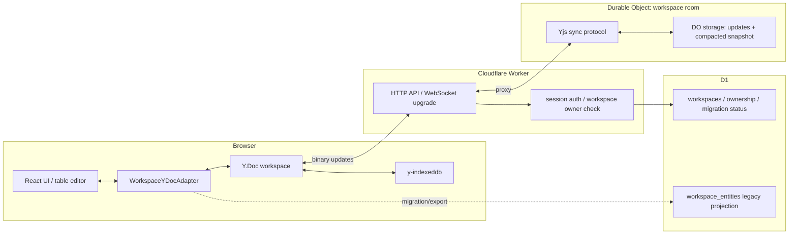

# klip-38-yjs-workspace-sync

## 现状结论（代码校准）

- 当前 workspace 自动同步已经是实体级 HTTP pull/push。前端入口是 `syncWorkspaceOnce()`，服务端入口是 `getWorkspaceChanges()` / `pushWorkspaceChanges()`，数据表是 `workspace_entities` 与 `workspace_mutations`。证据：`apps/web/src/services/workspaceIncrementalSyncService.ts`、`apps/worker/server-api/lib/workspaceEntities.ts`、`packages/db/migrations/0006_workspace_entities.sql`
- 本地写入路径使用 IndexedDB 业务 store + outbox。`enqueueWorkspaceOutboxItem()` 读取 `LocalWorkspaceEntityMeta` 后写入 `LocalWorkspaceOutboxItem`，并通过 `WORKSPACE_OUTBOX_ENQUEUED_EVENT` 触发后台同步。证据：`apps/web/src/utils/workspaceSyncStateDb.ts`
- 后台同步由登录态 provider 调度。`AuthSessionProvider` 监听 outbox、online、visibilitychange，在 signed-in 且已有 `workspaceId` 时调用 `runQueuedWorkspaceSync()`。证据：`apps/web/src/auth/AuthSessionProvider.tsx`
- 服务端冲突边界是 entity。`pushWorkspaceChanges()` 对比 `baseVersion`、`existing.version`、`contentHash`，冲突时返回 `serverPayload`。证据：`apps/worker/server-api/lib/workspaceEntities.ts`
- UI 仍以 `PersistedState` snapshot 为核心。`usePersistedState()` 通过 `setWorkspaceSnapshot()` 写入当前 source 的完整 state，并在 `WORKSPACE_SNAPSHOT_APPLIED_EVENT` 后重新 hydrate。证据：`apps/web/src/hooks/usePersistedState.ts`
- 表字段模型缺少稳定字段 ID。`FieldRow` 包含 `order`、`fieldName`、`fieldType`、`fieldComment` 等属性，行身份主要依赖数组顺序。证据：`packages/shared-types/src/index.ts`
- Worker 当前配置包含 D1 与 KV 绑定，Durable Object 绑定待新增。证据：`apps/worker/wrangler.toml`、`apps/worker/wrangler.e2e.toml`

## 背景

- 现有短期修复已经降低本地输入被远端旧 snapshot 回灌的概率，底层模型仍依赖实体级快照、版本和冲突分支。
- 文档类/协作文档类应用的核心一致性问题是多副本并发编辑最终收敛，并且本地输入即时可见。
- 当前 DDL Builder 的表设计数据天然接近文档结构：一个 workspace 下有草稿、保存表、文件夹，每张表内部有字段数组、索引、外键和配置。
- Yjs 官方将自身定位为用于 Google Docs/Figma 类协作应用的 CRDT，并提供 shared types、document update、IndexedDB 持久化和 WebSocket provider。参考：[Yjs Introduction](https://docs.yjs.dev/)、[Document Updates](https://beta.yjs.dev/docs/api/document-updates/)。
- Cloudflare Durable Objects 可以作为 WebSocket server，并且支持 Hibernation WebSocket API，适合按 workspace/document 做单点协调。参考：[Cloudflare Durable Objects WebSockets](https://developers.cloudflare.com/durable-objects/best-practices/websockets/)。

## 目标

1. 将 workspace 内容的长期主模型迁移到 `Y.Doc`。
2. 使用 `y-indexeddb` 作为浏览器本地持久化层，页面刷新后先从本地 Yjs 数据恢复。
3. 使用 Cloudflare Durable Object 作为每个 workspace 的 WebSocket sync room。
4. 表字段编辑改为 Yjs transaction，字段名、字段中文名、类型等属性以字段稳定 ID 归属同一行。
5. 远端更新应用到 `Y.Doc` 后由订阅机制驱动 UI 局部更新，降低 workspace 级重载抖动。
6. 保留当前 D1 `workspaces` 作为认证、归属、列表和迁移状态来源。
7. 提供从现有 `PersistedState` / `workspace_entities` 到 Yjs document 的一次性迁移路径。

## 非目标

- 多人 presence、协同光标、成员权限、团队 workspace 模型留给后续 KLIP。
- Postgres/Electric/PowerSync/Zero 迁移作为后续数据库选型评估。
- `review_history`、`table_versions`、`field_templates` 的迁移进入独立存储 KLIP。
- 视觉层大改版进入 UI 专项 KLIP。
- 本文只定义长期技术方案与迁移边界，具体实现 PR 拆分在后续 task plan 中展开。

## 术语表

- `Y.Doc`：Yjs 的 CRDT document，承载一个 workspace 的可合并状态。
- `shared type`：Yjs 内的 `Y.Map`、`Y.Array`、`Y.Text` 等可协同数据结构。
- `document update`：Yjs 生成的二进制增量。Yjs 文档说明该增量具备交换律、结合律、幂等性，客户端收到全部增量后收敛到同一状态。
- `workspace room`：一个 Durable Object 实例，按 `workspaceId` 映射，负责鉴权后的 WebSocket 同步、广播、持久化和 compact。
- `projection`：从 `Y.Doc` 派生出的 `PersistedState` 或 saved table metadata，用于兼容现有 UI 和 D1 查询。
- `legacy sync`：当前 `workspace_entities` + outbox + HTTP pull/push 实现。

## 评估维度

| 维度 | 判定问题 |
|---|---|
| 收敛正确性 | 多端并发编辑能否自动合并并最终一致 |
| 本地优先 | 离线、弱网、刷新页面时能否优先展示本地最新内容 |
| 改造成本 | 对当前 React hooks、IndexedDB、Worker/D1 的影响范围 |
| Cloudflare 适配 | 能否贴合 Worker、D1、Durable Objects 部署模型 |
| 可观测性 | 二进制 CRDT 状态能否调试、压缩、恢复 |
| 迁移风险 | 现有 `PersistedState`、saved tables、folders 能否平滑转换 |

## 评估结果

### 1. Yjs + y-indexeddb + Durable Object WebSocket

**结论：推荐作为长期目标态。**

- Yjs 直接解决多副本并发合并问题，document update 可乱序、多次应用并保持收敛。参考：[Yjs Document Updates](https://beta.yjs.dev/docs/api/document-updates/)。
- `y-indexeddb` 负责浏览器本地持久化，官方文档明确支持本地持久化、减少服务端交换数据量和离线编辑。参考：[y-indexeddb](https://docs.yjs.dev/ecosystem/database-provider/y-indexeddb)。
- `y-websocket` 的 client-server 模型与现有认证体系匹配，可通过 Worker 先校验 session，再代理到 Durable Object。参考：[y-websocket](https://docs.yjs.dev/ecosystem/connection-provider/y-websocket)。
- Durable Object 可作为每个 workspace 的协调点，WebSocket Hibernation 支持空闲休眠并保持连接语义。参考：[Cloudflare WebSocket Hibernation example](https://developers.cloudflare.com/durable-objects/examples/websocket-hibernation-server/)。

### 2. 继续增强 legacy HTTP outbox

**结论：适合作为迁移期稳定层。**

- 当前 outbox、`baseVersion`、`contentHash`、conflict store 已能覆盖单用户多设备的多数同步场景。
- 字段级并发合并需要围绕 `PersistedState.rows`、indexes、foreignKeys 自行设计 patch 与 merge 规则，工程复杂度会沿业务模型扩散。
- 云端推送/拉取后触发 hydrate 的机制仍需要局部订阅重写。

### 3. Replicache

**结论：适合 mutation-log 应用模型，迁移成本高于 Yjs 路径。**

- Replicache 的 rebase pending mutations 思路与当前 outbox 问题高度相关，适合用作协议设计参考。
- 接入 Replicache 需要把前端写入统一改成 mutator，并重写服务端 push/pull endpoint 与 client view 组织方式。
- DDL Builder 的核心编辑对象更像嵌套文档，Yjs 对 shared types 的表达更直接。

### 4. Automerge

**结论：适合作为备选 CRDT。**

- Automerge 对 JSON document 友好，概念上贴近 `PersistedState`。
- 当前生态与现有目标栈的直接组合需要补齐 IndexedDB provider、WebSocket server 与 Cloudflare DO 适配层。
- Yjs 在 web editor、provider、binary update、awareness 生态上更成熟，能降低本轮迁移不确定性。

### 5. Electric / PowerSync / Zero

**结论：适合数据库栈迁移阶段评估。**

- 这些方案围绕 Postgres/SQLite 或 query sync 组织，本轮 Cloudflare D1 + Worker 约束下会带来后端数据层迁移。
- 当前同步问题集中在文档编辑收敛和本地优先体验，CRDT document 模型的路径更短。

## 最终建议

长期方案采用 Yjs + y-indexeddb + Cloudflare Durable Objects WebSocket。

当前 `workspace_entities` 增量同步继续作为迁移期稳定层和导出恢复层。新实现先围绕默认 workspace 建立 `Y.Doc`，完成本地 Yjs shadow、远端 WebSocket sync、UI hook 迁移后，再把业务写入主路径切到 Yjs。

## 目标态设计



## 状态边界

| 状态 | 目标归属 | 迁移结论 |
|---|---|---|
| workspace ownership / active workspace | D1 `workspaces` | 保留 D1 |
| 当前 workspace 内容 | `Y.Doc` | 成为长期主模型 |
| 页面刷新后的本地恢复 | `y-indexeddb` | 替代当前多 store hydrate 主路径 |
| 草稿、保存表、文件夹业务数据 | `Y.Doc` shared types | 从 legacy stores 导入 |
| saved table 列表 metadata | `Y.Doc` projection | 前端派生；需要服务端搜索时再落 D1 projection |
| WebSocket 连接与广播 | Durable Object room | 每个 `workspaceId` 一个协调实例 |
| 当前 `workspace_entities` | legacy projection / recovery | 迁移期保留 |
| UI 面板状态、抽屉展开状态 | React/Zustand/local state | 保持本地 UI 状态 |

## Y.Doc 数据模型

### Workspace 根结构

```typescript
type WorkspaceYDocShape = {
  meta: Y.Map<unknown>;
  drafts: Y.Map<Y.Map<unknown>>;
  savedTables: Y.Map<Y.Map<unknown>>;
  savedDrafts: Y.Map<Y.Map<unknown>>;
  folders: Y.Map<Y.Map<unknown>>;
};
```

根节点约定：

- `meta.schemaVersion`: Yjs schema 版本。
- `meta.migratedFromWorkspaceVersion`: legacy cursor 或迁移批次。
- `drafts`: key 为 `draftId`，value 为 table document。
- `savedTables`: key 为稳定 `tableId`。迁移期可记录 `legacyNormalizedName`。
- `savedDrafts`: key 与 saved table 的 `tableId` 对齐。
- `folders`: key 为 `folder.id`。

### Table document 结构

```typescript
type TableYShape = {
  scalar: Y.Map<unknown>;
  fieldOrder: Y.Array<string>;
  fields: Y.Map<Y.Map<unknown>>;
  indexes: Y.Map<Y.Map<unknown>>;
  indexOrder: Y.Array<string>;
  foreignKeys: Y.Map<Y.Map<unknown>>;
  foreignKeyOrder: Y.Array<string>;
  options: Y.Map<unknown>;
};
```

迁移规则：

- 每个 legacy `FieldRow` 迁移为一个 `fieldId`。已有 row 根据顺序生成 UUID，并写入 `fieldOrder`。
- `fieldName`、`fieldType`、`fieldComment`、`nullable` 等字段属性写入对应 `fields.get(fieldId)`。
- 导出到 legacy `PersistedState` 时按 `fieldOrder` 还原 `rows`，并移除内部 `fieldId`。
- 新增字段创建 `fieldId` 后先写 `fields`，再写 `fieldOrder`。
- 删除字段先从 `fieldOrder` 移除，再删除 `fields[fieldId]`。

字段名和字段中文名的快速连续输入会生成两个 Yjs transaction。远端收到增量后按 CRDT 规则合并到同一 `fieldId` 的不同属性，客户端通过订阅更新对应单元格。

## 协议设计

### WebSocket endpoint

`GET /api/workspaces/:workspaceId/yjs`

流程：

1. Worker 校验 Better Auth session。
2. Worker 通过 D1 确认 `workspaceId` 属于当前 user。
3. Worker 根据 `workspaceId` 获取 Durable Object id。
4. Worker 将 WebSocket upgrade 请求转交给 Durable Object。
5. Durable Object 使用 Yjs sync protocol 交换 state vector、missing updates、后续 incremental updates。

### 消息格式

优先复用 `y-protocols/sync` 与 `y-protocols/awareness` 的二进制消息格式。客户端侧可基于 `WebsocketProvider` 的连接语义，服务端侧在 Durable Object 中实现必要的 sync/update/awareness 分发。

补充控制消息使用 JSON，保留在独立 channel：

```json
{
  "type": "ddlbuilder.workspace.meta",
  "workspaceId": "ws_123",
  "schemaVersion": 1,
  "serverTime": 1777651200000
}
```

### HTTP recovery endpoint

为调试、迁移和灾备保留两个 HTTP 端点：

| 方法 | 路径 | 用途 |
|---|---|---|
| `GET` | `/api/workspaces/:workspaceId/yjs/state` | 下载当前 compacted Yjs update |
| `POST` | `/api/workspaces/:workspaceId/yjs/import` | 从 legacy snapshot 初始化 Yjs document |

## 服务端设计

### Durable Object

新增 `WorkspaceYDocDurableObject`：

```typescript
export class WorkspaceYDocDurableObject extends DurableObject {
  private doc: Y.Doc | null = null;
  private nextSeq = 0;

  async fetch(request: Request): Promise<Response> {
    // accept WebSocket after Worker auth proxy
  }

  async webSocketMessage(ws: WebSocket, message: ArrayBuffer | string): Promise<void> {
    // decode y-protocols message, apply update, persist update, broadcast
  }
}
```

持久化策略：

- `snapshot`: compacted `Y.mergeUpdates()` 结果。
- `stateVector`: 当前 compacted snapshot 的 state vector。
- `update:{seq}`: compact 后新增的增量 update。
- `meta`: `workspaceId`、`schemaVersion`、`updatedAt`、`lastCompactedSeq`。

Compact 触发条件：

- update 数量达到阈值。
- 累计 update 字节数达到阈值。
- Durable Object alarm 周期触发。
- 手动运维 endpoint 触发。

### Worker 与配置

需要新增 Durable Object binding：

```toml
[[durable_objects.bindings]]
name = "WORKSPACE_YDOC"
class_name = "WorkspaceYDocDurableObject"
```

同时为 `wrangler.e2e.toml` 增加同名绑定，e2e 使用独立 namespace。D1 继续承担 `workspaces` 与 user ownership 校验。

## 前端设计

### Provider

新增 `WorkspaceYDocProvider`：

```typescript
type WorkspaceYDocContextValue = {
  doc: Y.Doc | null;
  synced: boolean;
  localSynced: boolean;
  connectionState: 'idle' | 'connecting' | 'connected' | 'offline' | 'error';
};
```

初始化流程：

1. 等待 `authSession.status === 'signed_in'` 且存在 `workspaceId`。
2. 创建 `const doc = new Y.Doc()`。
3. 创建 `new IndexeddbPersistence(docName, doc)`，等待 `synced` 事件后允许 UI 从本地 doc hydrate。
4. 创建 WebSocket provider 连接 `/api/workspaces/:workspaceId/yjs`。
5. 将 `doc` 暴露给 workspace hooks。

`docName` 约定：

```typescript
const docName = `ddlbuilder:workspace:${workspaceId}`;
```

### Adapter

新增 `WorkspaceYDocAdapter`，集中处理 legacy 类型转换：

- `toPersistedState(tableDoc): PersistedState`
- `applyPersistedState(tableDoc, state: PersistedState)`
- `listSavedTableMetadata(doc): SavedTableMetadata[]`
- `upsertFolder(doc, folder: TableFolder)`
- `deleteFolder(doc, folderId: string)`

现有 hooks 迁移顺序：

1. `usePersistedState()` 先通过 adapter 读写 active table。
2. `useSavedTables()` 改为从 `savedTables` shared map 派生 metadata。
3. `useFolders()` 改为从 `folders` shared map 派生 tree。
4. `workspaceIncrementalSyncService` 只保留 legacy import/export 与恢复用途。

### React 订阅

Yjs shared types 通过 observer 推动局部刷新：

```typescript
function subscribeTable(tableDoc: Y.Map<unknown>, notify: () => void) {
  tableDoc.observeDeep(notify);
  return () => tableDoc.unobserveDeep(notify);
}
```

React hook 使用 `useSyncExternalStore` 包装 Yjs 订阅，避免远端 update 触发整 workspace hydrate。

## 数据迁移方案

### Phase 0: Spike

- 新建最小 `Y.Doc` table adapter。
- 用现有 `PersistedState` fixture 验证 import/export 等价。
- 验证 `fieldName` 与 `fieldComment` 连续 transaction 在两个本地 doc 间收敛。

### Phase 1: 本地 Yjs shadow

- 使用 `pnpm add yjs y-indexeddb y-protocols` 添加依赖。
- 新增 `WorkspaceYDocProvider` 和 adapter。
- 从当前 IndexedDB stores 读取 workspace 内容并写入本地 `Y.Doc`。
- UI 仍走现有 hooks，测试迁移后的 doc 内容。

### Phase 2: Durable Object sync room

- 新增 `WorkspaceYDocDurableObject`、wrangler bindings、WebSocket endpoint。
- 实现 session/workspace owner 校验。
- 实现 Yjs update 持久化、广播、compact。
- 增加 Worker 单元测试与 e2e smoke。

### Phase 3: UI 主路径切换

- `usePersistedState()`、`useSavedTables()`、`useFolders()` 改为读写 Yjs adapter。
- 移除远端 update 后的 workspace 级 hydrate。
- 保留 legacy export，用于恢复和调试。

### Phase 4: Legacy 同步降级

- `workspace_entities` 停止承载实时工作区主路径。
- 保留从 `Y.Doc` 生成 legacy snapshot 的运维脚本。
- 清理 outbox 触发链路和 conflict UI。

## 回滚策略

- Phase 1 期间，Yjs 只作为 shadow 数据，删除本地 `y-indexeddb` doc 即可回到现有路径。
- Phase 2 期间，Durable Object WebSocket 失败时，前端继续使用本地 `y-indexeddb`，用户编辑仍在本地 doc 内。
- Phase 3 发布前必须具备 `Y.Doc -> PersistedState -> legacy stores` 导出脚本。
- 回滚发布时先运行导出脚本填充现有 IndexedDB stores，再部署当前 HTTP outbox 版本。
- 服务端保留 `workspace_entities` 至少一个版本周期，用于旧客户端恢复。

## 成本与风险

| 风险 | 影响 | 控制措施 |
|---|---|---|
| `FieldRow` 缺稳定 ID | 行级合并质量受影响 | 迁移时生成内部 `fieldId`，导出时还原 legacy rows |
| Yjs binary update 调试成本 | 问题定位变难 | 增加 doc snapshot 导出、state vector、update seq、compact 日志 |
| Durable Object hibernation 后恢复 | 连接恢复路径复杂 | 按 Cloudflare Hibernation API 存储 socket attachment 与 doc snapshot |
| update log 膨胀 | 存储和加载变慢 | 阈值 compact + alarm compact + 运维 compact endpoint |
| 现有 hooks 改动范围大 | 回归风险高 | adapter 先行，hooks 分阶段切换，storage e2e 全量覆盖 |
| WebSocket 鉴权 | 越权访问风险 | Worker 统一校验 session 与 workspace owner，DO 接收已认证请求 |

## 测试矩阵

| 场景 | 测试类型 | 覆盖要求 |
|---|---|---|
| `PersistedState` 导入导出 | Vitest | fixture 等价，字段顺序稳定 |
| 字段属性连续编辑 | Vitest | `fieldName` 与 `fieldComment` 两个 transaction 均保留 |
| 两个 doc 并发编辑同一表 | Vitest | 交换 updates 后状态收敛 |
| y-indexeddb 页面刷新恢复 | Playwright | 刷新后先显示本地最新内容 |
| WebSocket 同步 | Worker integration | A 客户端 update 后 B 客户端收到并应用 |
| Durable Object compact | Worker unit | compact 后 state vector 与 doc 内容一致 |
| 离线编辑后重连 | Playwright | 离线修改保留，联网后同步到另一页面 |
| legacy export | Vitest | Yjs doc 可导出为当前 `PersistedState` |
| 权限校验 | Worker test | 非 owner workspace 请求返回 403 |
| 迁移幂等 | Vitest | 同一 legacy workspace 多次 import 结果稳定 |

## 验收标准

- [ ] 新增 KLIP 对应 task plan，拆分本地 adapter、DO sync、UI 切换三个实施批次。
- [ ] `PersistedState <-> Y.Doc` 转换测试覆盖字段、索引、外键、分区、表选项。
- [ ] 页面刷新后从 `y-indexeddb` 恢复 workspace，首屏展示本地最新内容。
- [ ] 两个浏览器窗口编辑同一 workspace，字段名和字段中文名连续输入后双方最终一致。
- [ ] 远端 update 应用时保持当前编辑焦点和滚动位置。
- [ ] Durable Object 持久化 compact 后，新连接客户端能恢复完整 workspace。
- [ ] WebSocket endpoint 完成 session 与 workspace owner 校验。
- [ ] legacy `workspace_entities` 可从 Yjs doc 导出恢复。

## 待讨论

- saved table 的长期主键采用新 `tableId`，还是继续兼容 `normalizedName`。
- `Y.Doc` 粒度采用一个 workspace 一个 doc，还是一张表一个 subdoc。
- 服务端 projection 是否需要把 saved table metadata 同步写回 D1，支持未来服务端搜索和列表接口。
- awareness 与多人 presence 的边界进入哪个后续 KLIP。
- binary snapshot 的运维下载入口放在 admin console 还是用户设置页。

## 参考资料

- [Yjs Introduction](https://docs.yjs.dev/)
- [Yjs Document Updates](https://beta.yjs.dev/docs/api/document-updates/)
- [y-indexeddb](https://docs.yjs.dev/ecosystem/database-provider/y-indexeddb)
- [y-websocket](https://docs.yjs.dev/ecosystem/connection-provider/y-websocket)
- [Cloudflare Durable Objects WebSockets](https://developers.cloudflare.com/durable-objects/best-practices/websockets/)
- [Cloudflare WebSocket Hibernation example](https://developers.cloudflare.com/durable-objects/examples/websocket-hibernation-server/)
- `klips/klip-37-workspace-incremental-sync.md`
- `apps/web/src/services/workspaceIncrementalSyncService.ts`
- `apps/web/src/utils/workspaceSyncStateDb.ts`
- `apps/worker/server-api/lib/workspaceEntities.ts`
- `packages/db/migrations/0006_workspace_entities.sql`
